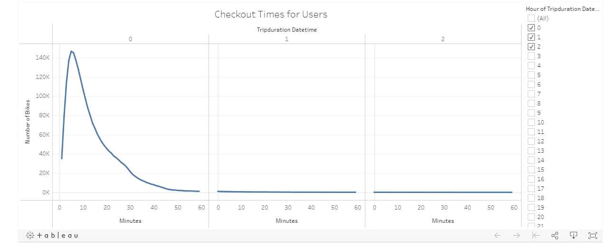
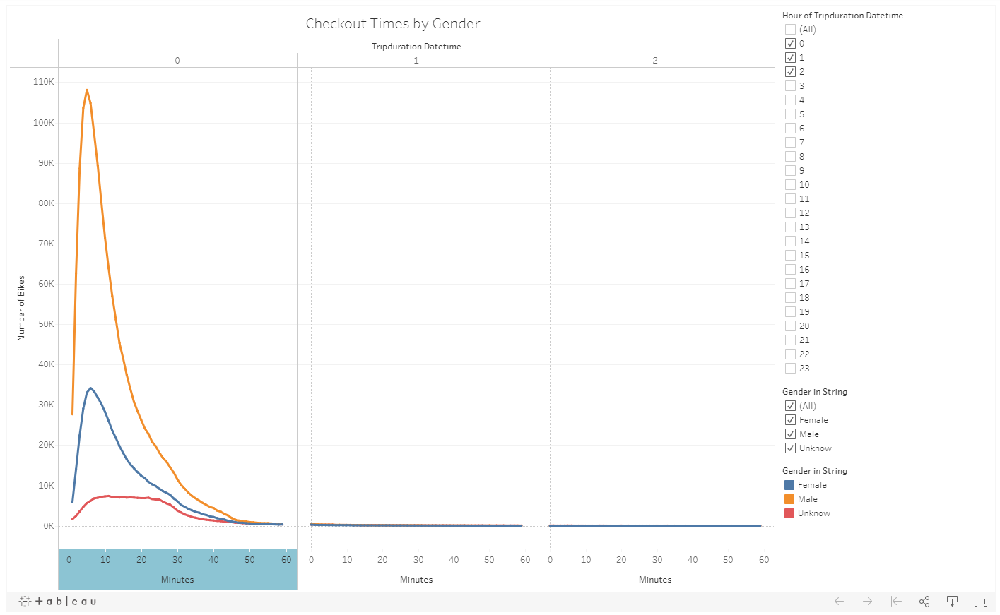
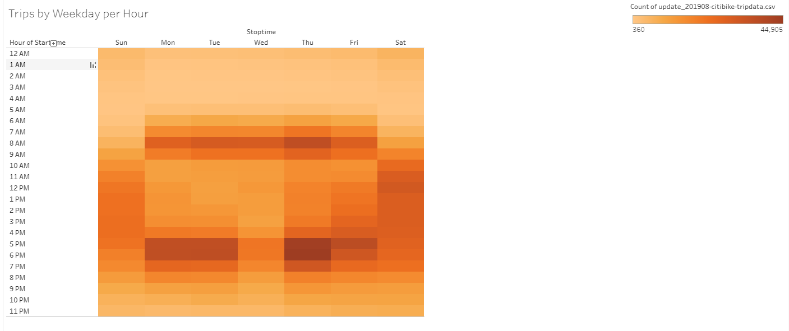
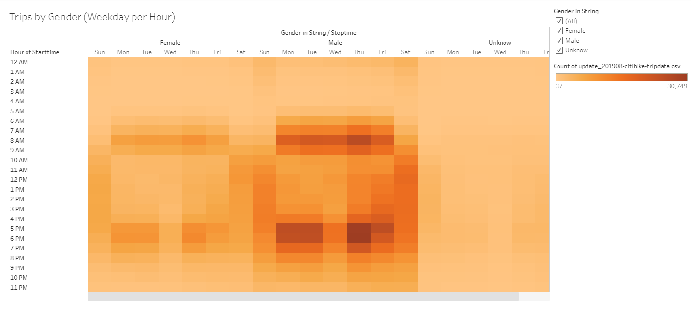
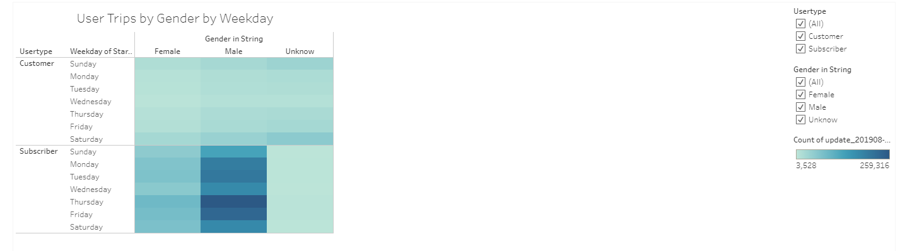
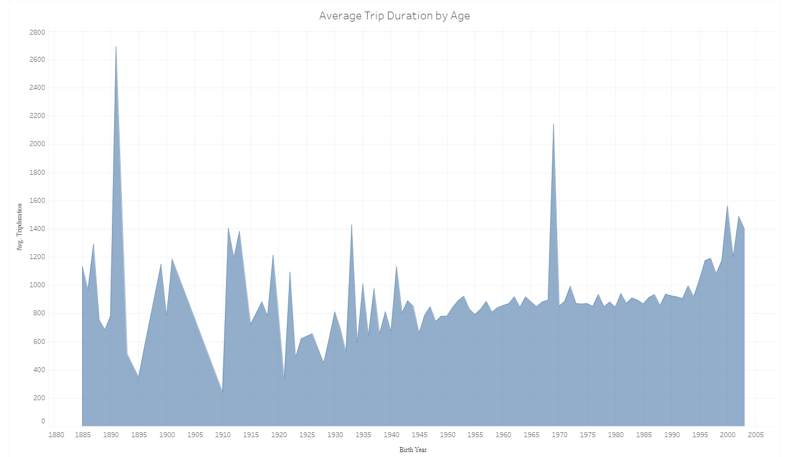
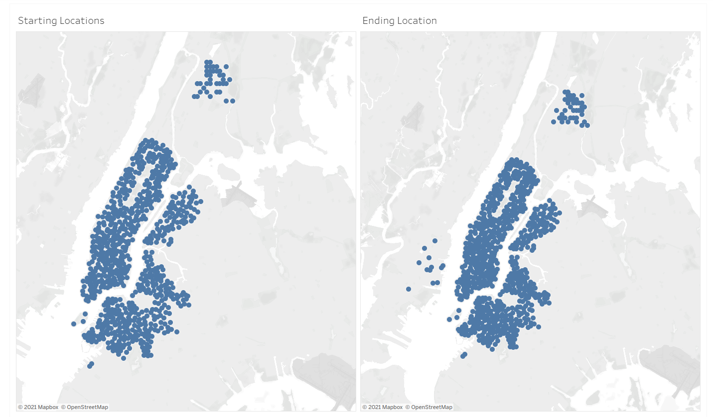

# bikesharing

## Overview
The purpose of the project is to convince investors that a bike-sharing program in Des Moines is a solid business proposal. One of the key stakeholders would like to see a bike trip analysis. To provide a good business insight, we use Citi Bike data that has been released to the public for analysis. Although it applies specifically to New York City instead of Des Moines, we want to use the data as starting point to get a visualization analysis of consumer behavior. We provide the analysis by story in Tableau and the written result that describes the key outcome of the NYC Citibike. 

## Results

1. Checkout Times for Users Visit

[Go to View in Tableau](https://public.tableau.com/profile/hsinyu.lin#!/vizhome/BikesharingChallenge_16205956108970/CheckoutTimesforUsers)

  The line graph displays the number of bikes checked out by duration for all users. The different duration can be filtered out. If clicking and skimming through all data, you will find that the most frequent trip duration is within an hour and less than 20 minutes. 

2. Checkout Times by Gender Visit

[Go to View in Tableau](https://public.tableau.com/profile/hsinyu.lin#!/vizhome/BikesharingChallenge_16205956108970/CheckoutTimesbyGender)

  The line graph displays the number of bikes that are checked out by duration for each gender by the hour, and the graph can be filtered by the hour and gender. The line visualization indicates that most riders are male. Moreover, both male and female shares a similar rent duration pattern. Their duration are mostly less than 20 minutes. The unknowns use bike slightly longer than male and female.

3. Trips by Weekday for Each Hour Visit

[Go to View in Tableau](https://public.tableau.com/profile/hsinyu.lin#!/vizhome/BikesharingChallenge_16205956108970/TripsbyWeekdayperHour)

  The heatmap shows the number of bike trips for each hour of each day of the week. From the heatmap, we can see that the peak hours are around 7am to 9am and 5pm to 7pm during weekday, and 10am to 7pm during weekend.

4. Trips by Gender (Weekday per Hour) Visit

[Go to View in Tableau](https://public.tableau.com/profile/hsinyu.lin#!/vizhome/BikesharingChallenge_16205956108970/TripsbyGenderWeekdayperHour)

  The heatmap shows the number of bike trips by gender for each hour of each day of the week, and the heatmap can be filtered by gender. Both male and female rides have a similar time preference to utilized bike. They mostly use bikes 7am to 9am and 5pm to 7pm during weekday, and 10am to 7pm during weekend. However, males customers are four to five times more than female.

5. User Trips by Gender by Weekday Visit

[Go to View in Tableau](https://public.tableau.com/profile/hsinyu.lin#!/vizhome/BikesharingChallenge_16205956108970/UserTripsbyGenderbyWeekday)

  The heatmap is shows the number of bike trips for each type of user and gender for each day of the week, and you can only filter by user and gender. There is no significant color difference in the upper heatmap so that we can conclude that there are no specific traits on random riders. They rent the bikes almost averagely through Sunday to Saturday, and they could be male, female, or unknown. Unlike random riders, subscriber in lower heatmap has some significant traits. They are mostly male, and they often use the bikes on Thursday, Friday, and sometimes on Monday and Tuesday. Female 

6. Average Trip Duration by Age

[Go to View in Tableau](https://public.tableau.com/profile/hsinyu.lin#!/vizhome/BikesharingChallenge_16205956108970/AverageTripDurationbyAge)

  The area chart represents the average trip duration by different ages. People who were born 1891 and 1969 has longer duration than others. I include the area chart and trips by weekday per hour in a dashboard and set filter action. If you click on year of 1891, you will see that heatmap shows that the group of people have rides on Sunday. If you click on year of 1969, you will see the heatmap shows that the group of people have rides mostly on Saturday and Sunday. 

7. Starting Locations and Ending Locations

[Go to View in Tableau](https://public.tableau.com/profile/hsinyu.lin#!/vizhome/BikesharingChallenge_16205956108970/Dashboard3)

  The symbol maps provide the geographical visualization ride starting locations and ending locations. Stations is close to each other in city. However, there are several ending locations are away from city but there are not starting location. This visualization could provide some insight how to arrange stations while running business.

## Summary

### Link to Tableau
[link to dashboard](https://public.tableau.com/profile/hsinyu.lin#!/vizhome/BikesharingChallenge_16205956108970/Story1?publish=yes)

### Additional visualizations

1. I would like to add an additional visualization with riders' purpose, for communting or for tourism, and repeat the analysis above if there are different timeframe they use the bikes.

2. Then I would like to make visualization to show top 10 routes for communting and tourism.

   After we figure out communting and tourism riders pattern on using the bikes, we could have a better insight on planning bike business in Des Moines.